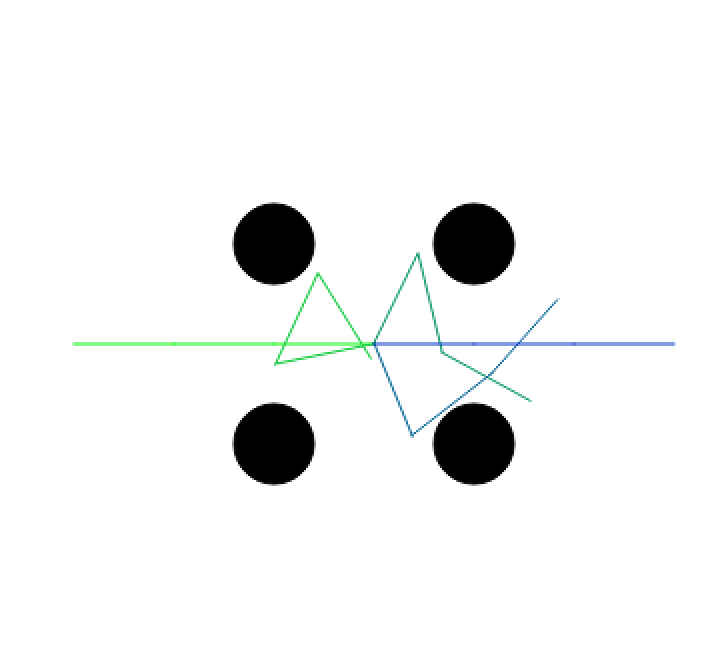
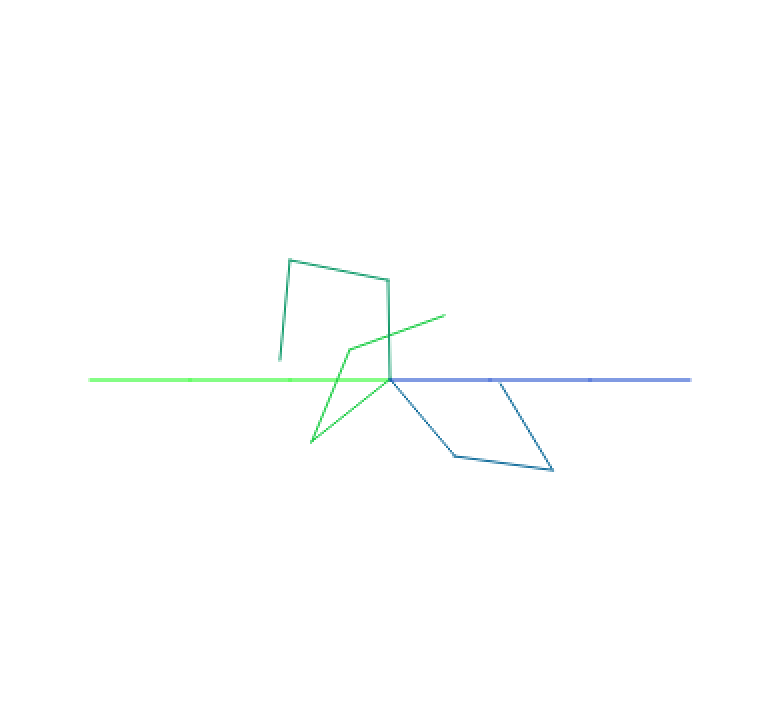
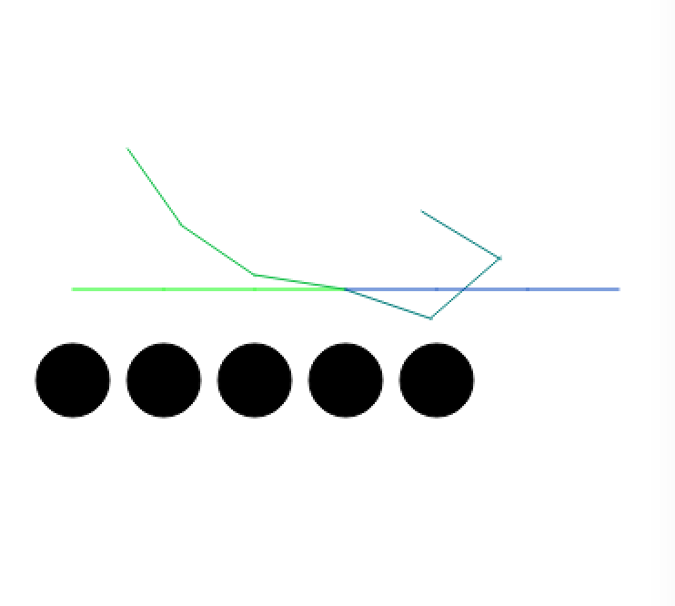
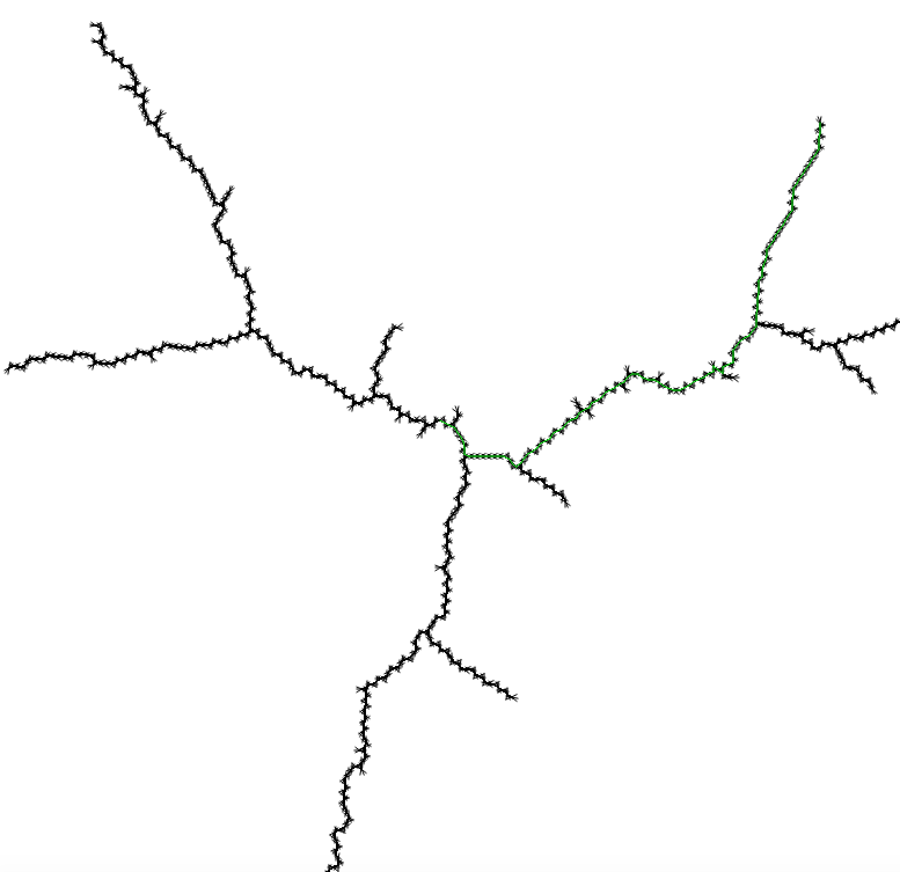
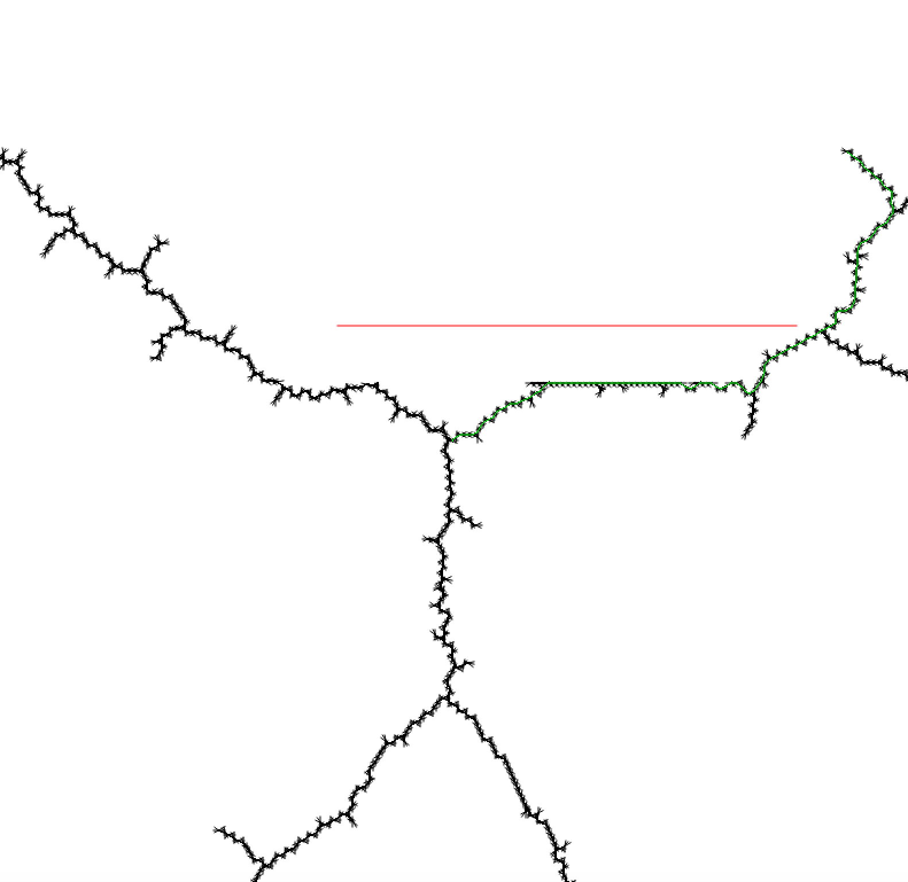
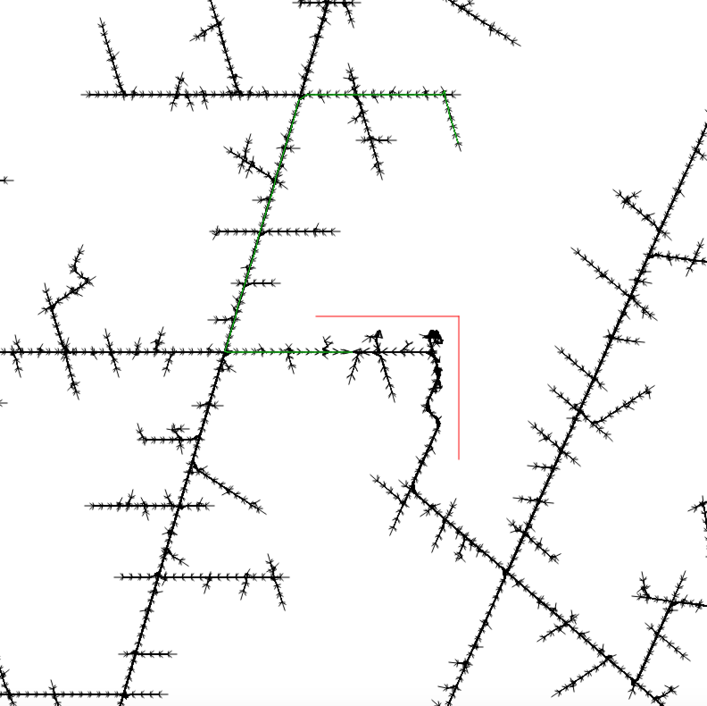

# Motion Planning Assignment Report
## Paolo Takagi-Atilano

### Introduction
In previous labs, all planning has occured in a discrete space, which has made it relatively simple to search for states.  This lab, on the other hand covers motion planning in continuous spaces, which makes such planning drastically more difficult.  This is because in a continuous space, there is alwasys some fixed number of states to search, with relatively easy successor states that can be found to iterate through.  But in a continuous space, ther are an infinite number of possible configurations, so it is a more difficult job to know which successor states should be iterated through and which should not, as it would take forever for a computer to iterate through a continuous space.  This report will consist of descriptions and solutions of two different problems which involve motion planning in a continuous space, and what methods were implemented in order to allow for a comptuer to find potential solutions.

### Arm Robot
The first problem was to write motion planning for a robot arm (at a fixed point) from start state to goal state (without hitting any obstacles).  In order to do this, the first step was to think of the configuration space as a set of angle tuples, where each angle tuple corresponded to some particular arm configuration for the robot.  Next, it was necessary to find a way to discretize the configuration space, so that a computer could iterate through all possibilities, and come up with solutions.

In order to accomplish this, I implemented a Probabilistic Roadmap (PRM).  This works by first generating a fixed number of valid random confifugrations.  Valid means that it did not collide with any obstacles, which was handled by collision functions below, and through shapely library.  Then it finds the k (some fixed constant) nearest neighbors to each node, and stores them in a list.  So in all, my roadmap was a tuple object where the first item was a set of nodes, and the second item was a dictionary where a node configuration mapped to a list of the nearest k nodes.  This was the roadmap generating part of the PRM.  Next was the querying.  In order to do this, a start and end node was provided.  Those nodes were then incorporated into the roadmap, and bfs was used to navigate the roadmap and find a path of nodes from start to goal nodes.

Also included in below code are kinematics functions for calculating angular distance and endpoints.

**Code:**

*Generating Roadmap:*

    def set_roadmap(self):
        print("building roadmap...")
        nodes = self.set_roadmap_nodes()
        print("nodes done!")
        neighbors = self.set_neighbors_map(nodes)
        print("neighbors done!")

        return nodes, neighbors
        
    def set_roadmap_nodes(self):
        nodes = set()
        for i in range(ROADMAP_NODES):
            config = self.random_config()
            while self.is_collision_configuration(config):
                config = self.random_config()
            nodes.add(tuple(config))
        return nodes
        
    def set_neighbors_map(self, nodes):
        neighbors = {}
        for node in nodes:
            n_neighbors = self.find_nearest_neighbors(node, nodes)
            neighbors[node] = n_neighbors

        return neighbors
        
    def find_nearest_neighbors(self, node, nodes):
        nearest = []

        for n in nodes:
            if node != n and not self.obstacle_inbetween(node, n) and n not in nearest:
                dist = compute_angular_distance(node, n)
                inserted = False
                for i in range(len(nearest)):
                    if dist < compute_angular_distance(nearest[i], n) and not inserted:
                        nearest.insert(i, n)
                        inserted = True
                        # pop of all the extra nodes are the end that are too long
                        while len(nearest) > NEIGHBORS:
                            nearest.pop(len(nearest) - 1)
                if not inserted and len(nearest) < NEIGHBORS:
                    nearest.append(n)
        return nearest
        
    def is_collision_configuration(self, angles):
        ends = self.compute_endpoints(angles)
        #ends.insert(0, (0,0))
        arm = geometry.LineString(ends)
        for s_obstacle in self.s_obstacles:
            if arm.intersects(s_obstacle):
                return True
        return False
        
    def obstacle_inbetween(self, config1, config2):
        increment = 0.1

        c_config1 = convert_some(config1)
        c_config2 = convert_some(config2)

        test = self.next_test_arm(increment, c_config1, c_config2)
        while test is not None:
            if self.is_collision_configuration(test):
                return True
            test = self.next_test_arm(increment, test, c_config2)
        return False

    def next_test_arm(self, increment, prev, goal):
        arm = []
        for i in range(len(prev)):
            if prev[i] < goal[i]:
                arm.append(prev[i] + increment)
                if arm[i] > goal[i]:
                    return None
            else:
                arm.append(prev[i] - increment)
                if arm[i] < goal[i]:
                    return None
        return arm        
       
*Querying:* 

	    def query(self, start, goal):
        print("querying...")
        self.roadmap[0].add(tuple(start))
        self.roadmap[0].add(tuple(goal))

        self.roadmap[1][tuple(start)] = self.find_nearest_neighbors(tuple(start), self.roadmap[0])

        ns_goal = self.find_nearest_neighbors(tuple(goal), self.roadmap[0])
        print(ns_goal)
        # goals fix:
        for node in ns_goal:
            self.roadmap[1][node].append(tuple(goal))

        sol = bfs_search(start, goal, self.roadmap[0], self.roadmap[1])
        if sol is None:
            print("No solution found")
        return sol

*Kinematics*      

    def compute_endpoints(self, angles_list):
        end_points = [self.origin]

        for i in range(len(angles_list)):

            curr_angle = angles_list[i]

            for j in range(i):
                curr_angle += angles_list[j]

            temp = (end_points[len(end_points) - 1][0] + math.cos(curr_angle) * ARM_LENGTH,
                    end_points[len(end_points) - 1][1] + math.sin(curr_angle) * ARM_LENGTH)
            end_points.append(temp)
        return end_points

	def compute_angular_distance(one, two):
		distance = 0
		for i in range(len(one)):
        diff = one[i] - two[i]
        if abs(diff) > math.pi:
            diff = convert(diff)
        distance += diff
    return distance

	def convert_some(angles):
		converted_angles = []
		for i in range(len(angles)):
			if angles[i] > math.pi:
				converted_angles.append(convert(angles[i]))
			else:
          	converted_angles.append(angles[i])
    	return converted_angles

	def convert_all(angles):
		converted_angles = []
		for i in range(len(angles)):
			converted_angles.append(convert(angles[i]))
    	return converted_angles

	def convert(angle):
		return 2 * math.pi - angle

**Results:**

Below are some images of different obstacle layouts, and the following motion of the robot arm.  The more green the closer that configuration is to the initial configuration, and the more blue the closer it is to the final configuration.

*Test 1:*

*Test 2:*

*Test 3:*

**Conclusion:**

I was quite pleased, as the arm seems to move in a pretty sensible fashion while avoiding obstacles to reach from start to goal configurations.  In Test 1, you can see that the arm actually jumps past the goal in order to avoid obstacles, and the can it navigate to the goal.  Test 2 is a fairly trivial obstacle free test.  Test 3 shows the arm avoids the bottom where all of the obstacles are, in order to move towards the final goal configuraion.

**Running Tests:**

In order to run these tests for yourself, please run `draw.py`.  You will see at the bottom that different obstacle configurations are commented out, please uncomment the test which you would like to run.

### Mobile Robot
The next problem was to write motion planning for a mobile robot to move from start configuration to goal configuration through some obstacle course, without hitting any of the obstacles.

In order to accomplish this, I implemented a Rapidly Exploring Random Tree (RRT).  This works by selecting a random point in the configuration space, and then expanding towards it (in all 6 directions, assuming that none hit any obstacles).  It continues to do this until it reaches a configuration that is sufficiently close to the goal configuration, at which point it returns the solution.  Below are relevant code snippets which make implementing this algorithm possible.

**Code:**

	def build_rrt(q_init, q_goal, obstacles):
		curr = RrtNode(q_init)
		leaves = set()
		leaves.add(RrtNode(q_init))
		while not is_goal(curr.state, q_goal):
			q_rand = random_config()
			curr = nearest_leaf(leaves, q_rand)

			for child in expand(curr, obstacles):
				leaves.add(child)

			leaves.remove(curr)

		tree = []
		for leaf in leaves:
			tree.append(backchain(leaf))
		tree.insert(0, backchain(curr))

		return tree

	def expand(parent_node, obstacles):
		children = set()
		parent = planarsim.transform_from_config(parent_node.state)

		for control in planarsim.controls_rs:
		child = planarsim.config_from_transform(planarsim.single_action(parent, control, TIMESTEP))
		if not is_collision(child, parent_node.state, obstacles):
			children.add(RrtNode(child, (parent_node, control)))
		return children
		
	def random_config():
		x = random() * (2 * (WIDTH) - 1) - WIDTH
		y = random() * (2 * (HEIGHT) - 1) - HEIGHT
		th = random() * 2 * pi
		return x,y,th
		
	def nearest_leaf(leaves, q_rand):
		d = float('inf')
		leaf = None
		for l in leaves:
			e_dist = dist(l.state, q_rand)
			if e_dist < d:
				d = e_dist
				leaf = l
		return leaf
		
There are other helper functions, but are relatively trivial.  Refer to `rrt.py` for further information about how this implementation works.

**Results:**

*Test 1:*

*Test 2:*

*Test 3:*

**Conclusion:**

I am rather pleased with these tests, as they all seem to make sense.  Test 1 is just the basic run through without any obstacles to see if it works, then Test 2 adds an obstacles to see what the algorithm will do.  It goes around it in a logical fashion and continues towards the path.  Finally, Test 3 adds another obstacle so that it is more difficult to move around.  This tree is much larger than the other two, which makes sense because more searching and random point placement is needed in order to find a way that moves around these obstacles and still reaches the goal.  You will see that it is especially dark around the corner of the obstacles, which makes sense as lots of searching that would have occured in the space outside of those obstaces will not reuslt in ending at that point as it cannot move past the obstacle. This all makes sense.

**Running Tests:**

In order to run these tests, you will see multiple tests commented out at the bottom of `display_planner.py`.  Note that I have messed around with some of the display scaling settings and constants for the RRT algorithm, so the pictures may look a bit different but will still provide valid solutions.  Feel free to mess around with those numbers if you wish.

### Literature Review (Bonus)

For my Literatuer Review, I chose to read "Robot Motion Planning: A Distributed Representation Approach" by Barraquand and Latombe.  In this paper, they propsed a new approach to robot path planning.  In their system, they decided to find the local minima of a potential function that was defined over the configuration space.  They they connected those local minima in a graph from which could be searched.  This is an interesting different way to construct a graph, somewhat similar to the voronoi graph that we discussed in class.  

Next, the made their own navigation functions from which they used to determine how the robot should move.  Their metods worked significantly well, in that they solved the problems several magnitude sfaster than other robot motion planners.  It was also capable of solving many other sorts of problems that most motion planners could not.  

One interesting aspect is that they implemented a form of path optimization.  I thnk that this is very interesting because my options I am fairly certain that the mobile robot went back and forth multiple times at places before heading toward the goal, but with their path optimization their movile robots apepared to (from their diagrams) move in a much more optimized matther, such that all the actions were clearly determined and moved towards the goal.  

They came up with two different versions of this planner, called the Best-First Planner, and the Rnadomized Path Planner.  Both were different in the way in which they escaped the local minima of the function that they used to discretize the search space.  The Randomized was faster as it was random, but the BFP provided better solutions, as it preformed a best first search of the collisoin free subset of the configuration space grid using the potential formula.

In all, it seems that their efforts were very succesful in that their planners were faster than others are also quite optimized.  It presented some intesting ideas that I think I could have used if I had more time to work on my planners.
